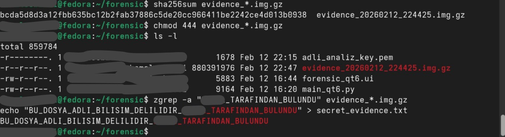

# 🕵️‍♂️ Remote Forensic Imager - Professional Edition

**Remote Forensic Imager** is a professional-grade digital forensics tool designed to acquire full disk images from remote cloud servers (AWS EC2, VPS, etc.) with high integrity and automated reporting.

Developed with **Python** and **PyQt6**, this tool follows forensic best practices to ensure a secure **Chain of Custody (CoC)**.


## 🚀 Key Features

* **Advanced Logging:** Captures acquisition start/end times, total duration, and remote IP logs.
* [cite_start]**Security Verification:** Automatically fetches and logs the **Remote SSH Fingerprint** to ensure a secure connection[cite: 3].
* [cite_start]**Automated Forensic Reporting:** Generates a detailed `.txt` report including a **Chain of Custody** table, full command history, and SHA-256 hash values[cite: 3, 71].
* [cite_start]**Safe Mode:** Implements `conv=noerror,sync` to handle disk bad sectors without compromising the image[cite: 17, 55].
* [cite_start]**Integrity Protection:** Encourages write-blocking with `chmod 444` and performs post-acquisition hash verification[cite: 35, 40].

## 🛡️ Automated Forensic Reporting & Chain of Custody

The most critical feature for academic and legal standards is the automated reporting system. Each session produces a comprehensive log that serves as a digital seal for the evidence.


*Figure: Automated Forensic Report including Case Info, Timestamps, and Chain of Custody (CoC).*

## 📖 Usage

1.  [cite_start]**Launch the Application:** `python3 main_qt6.py` [cite: 15]
2.  [cite_start]**Enter Case Info:** Fill in **Case Number** and **Examiner Name** for the official report[cite: 3].
3.  **Configure Target:**
    * [cite_start]**Server IP:** Target's public IP (e.g., 51.20.74.168)[cite: 11].
    * [cite_start]**User/Key:** SSH credentials (e.g., `ubuntu` and `.pem` file)[cite: 20, 21].
    * [cite_start]**Disk:** Target block device (e.g., `/dev/nvme0n1` for AWS Nitro)[cite: 12].
4.  [cite_start]**Acquisition:** Click **"Take Image and Analyze"**[cite: 24, 65]. [cite_start]The tool will stream the disk and automatically generate a SHA-256 hash and a Forensic Report[cite: 35, 59].

## 🛠️ Verification & Analysis

After acquisition, the tool supports manual verification to ensure the data is intact:

```bash
# Verify Integrity
[cite_start]sha256sum evidence_*.img.gz [cite: 35, 39]

# Apply Write Protection
[cite_start]chmod 444 evidence_*.img.gz [cite: 40]

# Forensic Keyword Search (Analysis without mounting)
[cite_start]zgrep -a "KEYWORD" evidence_*.img.gz [cite: 41]
```


*Figure: Manual verification and content discovery within the acquired image.*

## ⚠️ Disclaimer

This tool is intended for **authorized forensic investigations** only. The developer (**Futhark**) is not responsible for any unauthorized use.

---

**Developed by Futhark**
