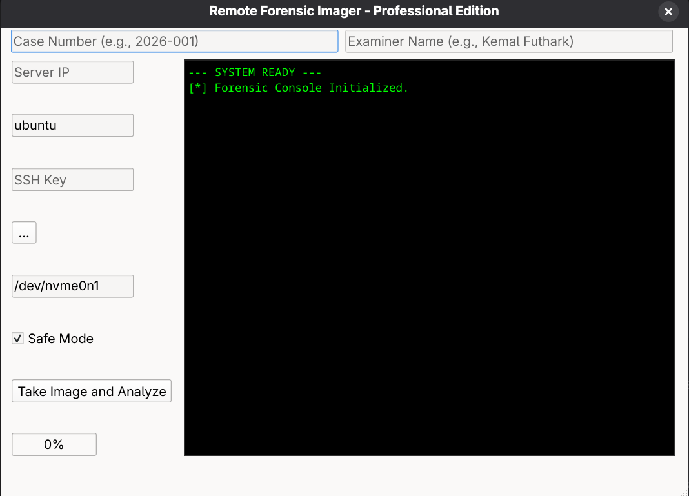
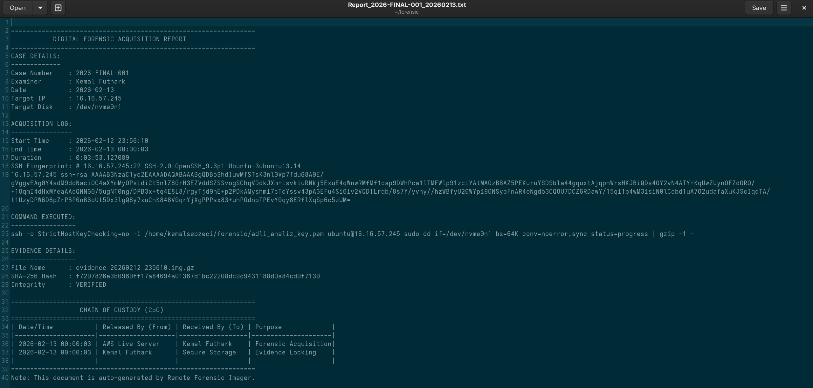

# 🕵️‍♂️ Remote Forensic Imager - Professional Edition

**Remote Forensic Imager** is a professional-grade digital forensics tool designed to acquire full disk images from remote cloud servers (AWS EC2, VPS, etc.) with high integrity and automated reporting.

Developed with **Python** and **PyQt6** on **Fedora 43 Workstation**, this tool follows forensic best practices to ensure a secure **Chain of Custody (CoC)**.



## 🚀 Key Features

* **Advanced Logging:** Captures acquisition start/end times, total duration, and remote IP logs.
* **Security Verification:** Automatically fetches and logs the **Remote SSH Fingerprint** to ensure a secure connection.
* **Automated Forensic Reporting:** Generates a detailed `.txt` report including a **Chain of Custody** table, full command history, and SHA-256 hash values.
* **Safe Mode:** Implements `conv=noerror,sync` to handle disk bad sectors without compromising the image.
* **Integrity Protection:** Encourages write-blocking with `chmod 444` and performs post-acquisition hash verification.

---

## 🧪 Setting Up a Test Laboratory

To see the tool in action without a real incident, you can set up a test environment in minutes.

### 1. Prepare Your Target Server (AWS/VPS)
Connect to your remote server via SSH and create a "secret" evidence file to be discovered later:

```bash
# Connect to your server
ssh -i your-key.pem ubuntu@your-server-ip

# Create a dummy evidence file
echo "SECRET_EVIDENCE_DATA_FOUND_BY_FUTHARK" > secret_evidence.txt

# Verify the file is there
cat secret_evidence.txt
```

### 2. Run the Acquisition
1. Launch `python3 main_qt6.py` on your local machine.
2. Enter the **Case Number** (e.g., `2026-FINAL-001`) and your name.
3. Fill in the server details (IP: `51.20.74.168`, Disk: `/dev/nvme0n1`) and click **"Take Image and Analyze"**.

### 3. Verify and Find the Evidence
Once the acquisition is complete, use the following forensic commands in your terminal to find the hidden data:

```bash
# List the acquired file (It will be read-only)
ls -l evidence_*.img.gz

# Forensic search for the 'secret' keyword inside the compressed image
zgrep -a "SECRET_EVIDENCE" evidence_*.img.gz
```

---

## 🛡️ Automated Forensic Reporting & Chain of Custody

The tool automatically generates a comprehensive forensic report upon completion. This report is essential for maintaining the **Chain of Custody (CoC)**.


*Figure: Automated Forensic Report including Case Info, Remote SSH Fingerprint, and CoC Table.*

---

## 🛠️ Requirements & Installation

* **OS:** Linux (Tested on Fedora 43 / Gnome 49.3)
* **Python:** 3.10+
* **Dependencies:** `pip install PyQt6`

```bash
# Clone the Repository
git clone [https://github.com/Futhark1393/Remote-Forensic-Imager.git](https://github.com/Futhark1393/Remote-Forensic-Imager.git)
cd Remote-Forensic-Imager

# Run the App
python3 main_qt6.py
```

## ⚠️ Disclaimer

This tool is intended for **authorized forensic investigations** only. The developer (**Futhark**) is not responsible for any unauthorized use.

---

**Developed by Futhark**
