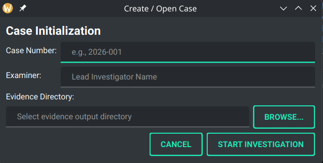
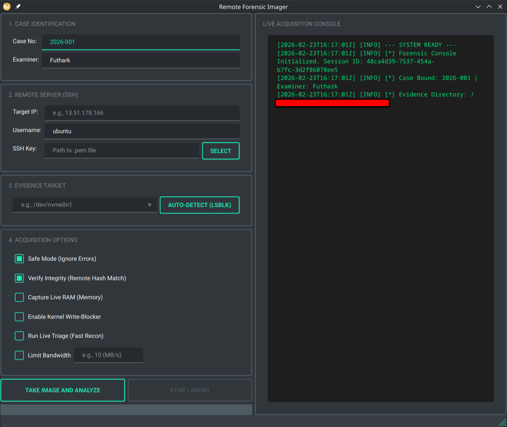
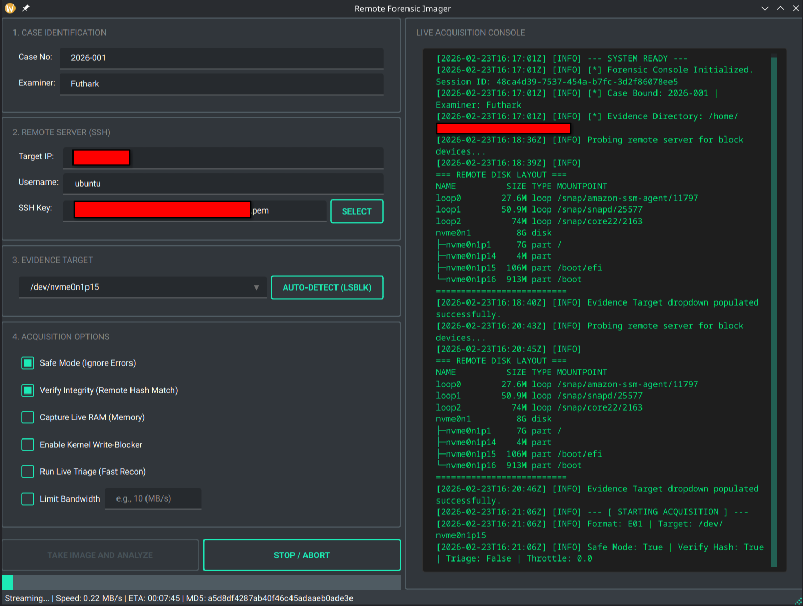
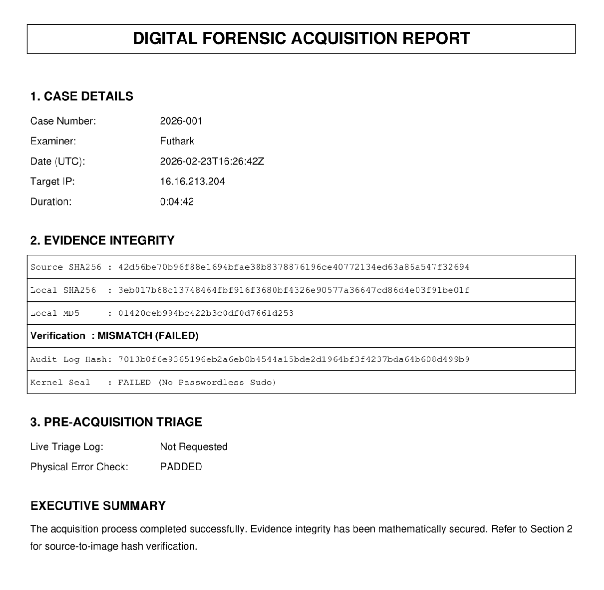

# Remote Forensic Imager (RFI)

Author: Futhark1393  
Version: 2.0.0

Remote Forensic Imager (RFI) is a case-first remote disk acquisition tool built with Python and PyQt6.

It enforces structured forensic workflows, generates a cryptographically chained audit trail (JSONL), supports optional source-to-stream verification, and produces TXT/PDF forensic reports suitable for evidentiary documentation.

---

## Interface Preview

~~~text
screenshots/
├── case_wizard.png
├── main_ui_idle.png
├── disk_discovery.png
├── acquisition_running.png
└── report_preview.png
~~~

---

## Core Features

### Case-First Workflow
- Mandatory Case Wizard at startup
- Case Number + Examiner required
- Evidence directory binding required
- No acquisition without an active case context

### Forensic Audit Logging
- JSONL structured audit trail per session
- Cryptographic hash chaining (`prev_hash → entry_hash`)
- Deterministic JSON serialization
- Forced disk flush (`fsync`) per entry
- Optional file sealing (`chmod 444` + `chattr +i` when available)
- Offline chain verification

### Acquisition & Integrity
- SSH-based remote acquisition
- Remote disk discovery (`lsblk`)
- On-the-fly hashing (MD5 + SHA-256)
- Optional post-acquisition remote SHA-256 verification
- Safe Mode (pads unreadable sectors with zeros)
- Optional kernel-level write-blocker enforcement

### Reporting
- TXT forensic report
- PDF forensic report
- Includes:
  - Local hash values
  - Optional source hash
  - Verification result
  - Audit trail hash
  - Seal status

---

## Architecture

~~~text
codes/
├── gui.py
├── threads.py
├── logger.py
├── report_engine.py
├── dependency_checker.py
└── __init__.py
~~~

Design goals:
- Fail-secure behavior
- Tamper-evident logging
- Thread-safe acquisition
- Clear separation of responsibilities
- Minimal external runtime assumptions

---

# Installation

## 1. Clone

~~~bash
git clone https://github.com/Futhark1393/Remote-Forensic-Imager.git
cd Remote-Forensic-Imager
~~~

---

## 2. System Dependencies (Linux)

RFI requires Qt runtime libraries.

### Ubuntu / Debian

~~~bash
sudo apt update
sudo apt install -y \
    libegl1 \
    libgl1 \
    libglib2.0-0 \
    libxkbcommon0 \
    libxkbcommon-x11-0 \
    libxcb1 \
    libxcb-icccm4 \
    libxcb-image0 \
    libxcb-keysyms1 \
    libxcb-randr0 \
    libxcb-render0 \
    libxcb-render-util0 \
    libxcb-shape0 \
    libxcb-shm0 \
    libxcb-sync1 \
    libxcb-xfixes0 \
    libxcb-xinerama0 \
    libxcb-xkb1 \
    libxrender1 \
    libxi6 \
    libsm6 \
    libice6 \
    libfontconfig1 \
    libfreetype6
~~~

### Fedora

~~~bash
sudo dnf install qt6-qtbase qt6-qtbase-gui
~~~

---

## 3. Python Dependencies

~~~bash
pip install -r requirements.txt
~~~

Or manually:

~~~bash
pip install pyqt6 qt-material paramiko fpdf
~~~

---

## 4. Optional: E01 Support

E01 imaging requires libewf + pyewf.

### Ubuntu / Debian

~~~bash
sudo apt install libewf-dev
pip install pyewf
~~~

### Fedora

~~~bash
sudo dnf install libewf-devel
pip install pyewf
~~~

If pyewf is not installed:
- RAW acquisition works normally
- E01 option will raise a runtime error

---

# Running

~~~bash
python main_qt6.py
~~~

If you created an alias:

~~~bash
rfi
~~~

---

# Workflow

1. Start RFI → Case Wizard appears
2. Define Case Number and Examiner
3. Bind Evidence Directory
4. Enter SSH details
5. Discover disks (optional)
6. Select acquisition target
7. Choose format (RAW / E01)
8. Acquire → Report generated → Audit sealed

---

# Output Artifacts

Inside the selected Evidence Directory:

~~~text
AuditTrail_<case>_<session>.jsonl
AuditConsole_<case>.log
Report_<case>_<timestamp>.txt
Report_<case>_<timestamp>.pdf
evidence_<case>_<timestamp>.raw / .E01
~~~

---

# Audit Chain Verification

~~~python
from codes.logger import AuditChainVerifier

valid, message = AuditChainVerifier.verify_chain("AuditTrail_CASE_SESSION.jsonl")
print(valid, message)
~~~

Any modification, deletion, or reordering of records will break the chain.

---

# Notes on Verification

- E01 is a container format. Integrity is calculated on the acquisition stream.
- If acquiring from a live system disk, post-acquisition source hashing may differ due to ongoing writes.
- For strict source-to-image equivalence, use:
  - Unmounted disks
  - Snapshots
  - Write-blocked devices

This behavior is expected on live systems.

---

# Versioning

RFI follows Semantic Versioning:

- MAJOR: Breaking architectural changes
- MINOR: New features
- PATCH: Bug fixes

Example:
2.0.0 → Major feature release  
2.0.1 → Bugfix  
2.1.0 → New feature  

---

# License

MIT License — see `LICENSE` file.

---

# Author

Futhark1393